# Дипломная работа по курсу "DevOps-инженер"

Выполнил: Кайдалов Виталий Сергеевич
E-mail: vitalykay@gmail.com

## Этапы Выполнения

### 1. Регистрация доменного имени

На бесплатном сервисе [freenome.com](freenom.com) зарегистрировано доменное имя
> vitalykay-netology-diplom.tk

Добавлены А-записи, указывающие на зарезервированный в Yandex.Cloud статический публичный адрес
> * www.vitalykay-netology-diplom.tk
> * gitlab.vitalykay-netology-diplom.tk
> * grafana.vitalykay-netology-diplom.tk
> * prometheus.vitalykay-netology-diplom.tk
> * alertmahager.vitalykay-netology-diplom.tk

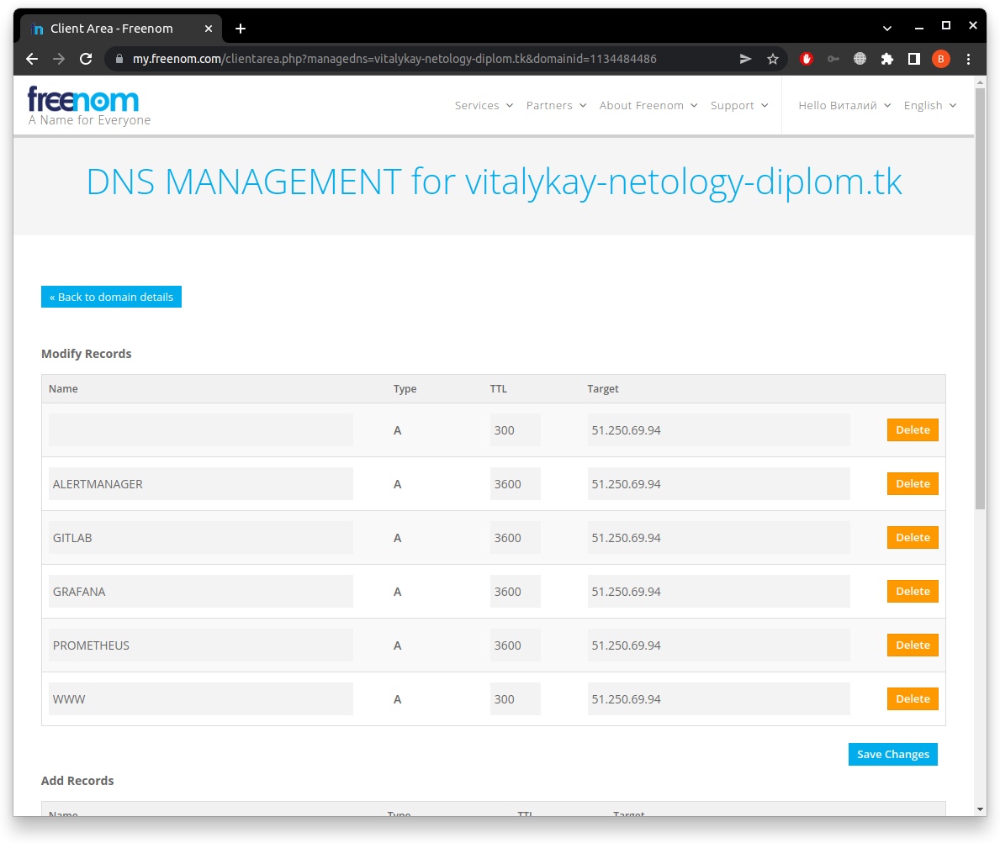

### 2. Подготовка инфраструктуры

Для выполнения задания использовался облачный сервис Yandex.Cloud.
Подготовка инфраструктуры осуществлялась с помощью *Terraform*.

*Предварительная подготовка.*
1. В Yandex.Cloud создан сервисный аккаунт, через который осуществляется авторизация Terraform в облаке. Для этого аккаунта с помошью cli-утилиты получен ключевой файл *key.json*, для авторизации в облаке при создании инфраструктуры и статический ключ для доступа к S3-бекенду в Яндексе.

2. Backend для Terraform создается так же с помощью [Terraform](terraform/s3backend/). 
В файле [variables.tf](terraform/s3backend/variables.tf) задаются следующие переменные:
* **yandex_cloud_id** - ID обака в Яндекс
* **yandex_folder_id** - ID папки в облаке Яндекса
* **yandex_sa_id** - ID сервиского аккаунта, для которого создается статический ключ для создания S3 бакета

В результате выполнения terraform-кода создается S3-бакет для хранения бекенда terraform
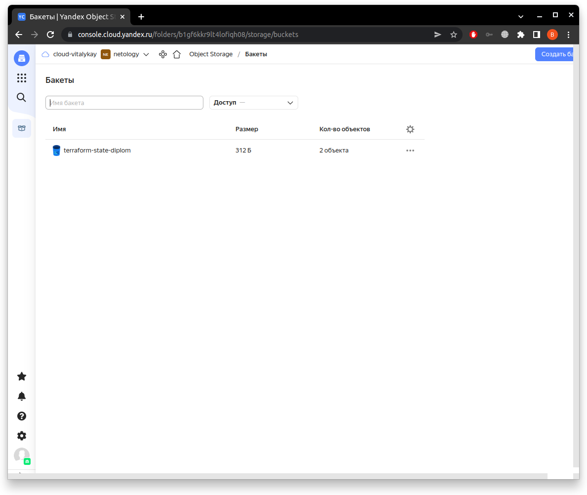

3. Настройка workspaces
Для terraform создан workspace с названием **stage**
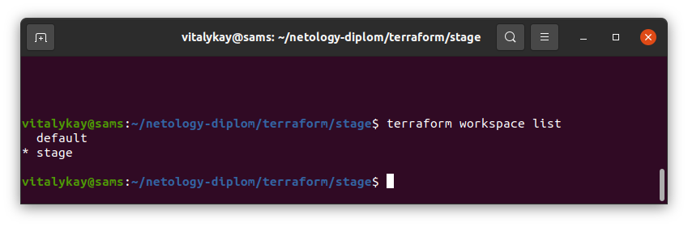

Необходимо проинициализировать бекенд для проекта командой
```
terraform init -backend-config="access_key=<your access key>" -backend-config="secret_key=<your secret key>"
```

При работе Terraform состояние проекта в этом рабочем пространстве сохраняется в соответствующую папку в бакете в облаке Яндекса.
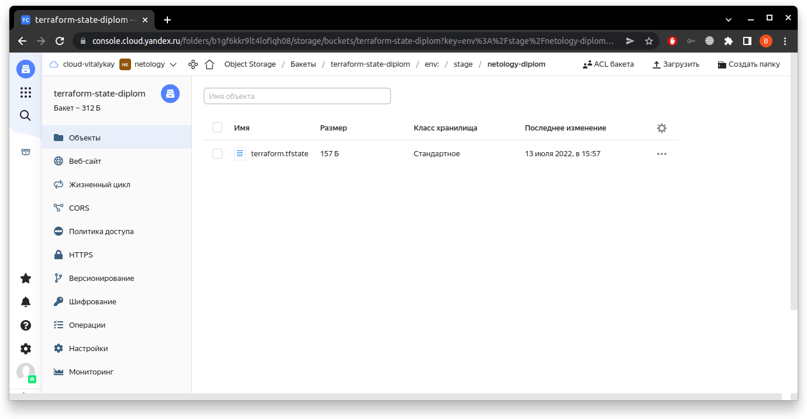

4. Создание VPC с подсетями в разных зонах доступности
В файле [main.tf](terraform/stage/main.tf) создаются подсети public-subnet и private-subnet в разных зонах доступности ru-central1-a и ru-central1-b соответственно.

5. Команды *terraform apply* и *terraform destroy*
В файле [variables.tf](terraform/stage/variables.tf) задаются следующие переменные
* **yandex_cloud_id** - ID обака в Яндекс
* **yandex_folder_id** - ID папки в облаке Яндекса
* **yandex_external_ip** - заранее зарезервированный статический публичный IP-адрес
* **yandex_ubuntu_user** - имя пользователя для виртуальных машин с ОС Ubuntu
* **yandex_centos_user** - имя пользователя для виртуальных машин с ОС CentOS

Выполнение всех указанных выше действий позволяет выполнять команды *terraform apply* и *terraform destroy* без дополнительных ручных действий.

В результате выполнения команды *terraform apply* создаются cледующие ресурсы
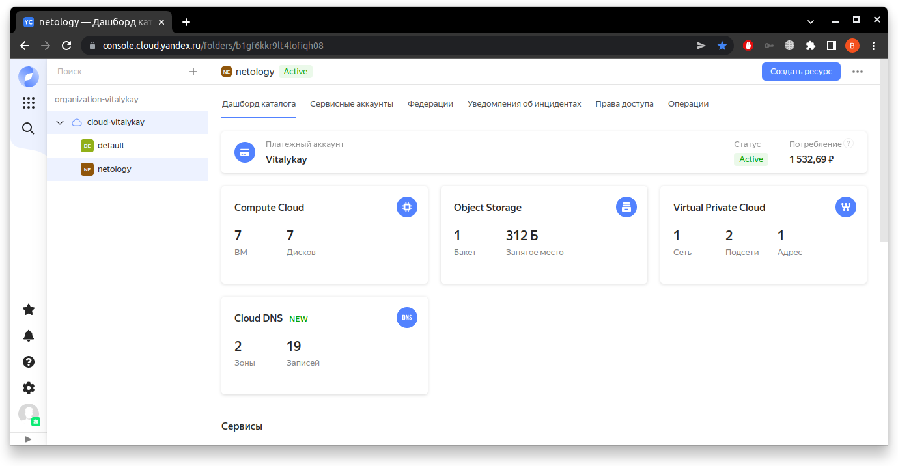

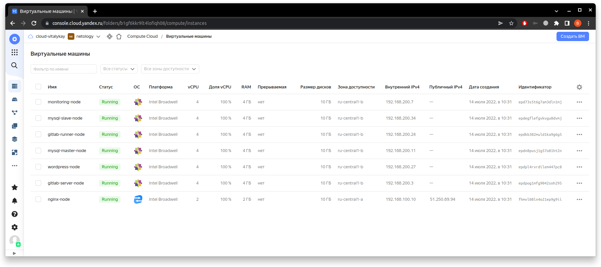

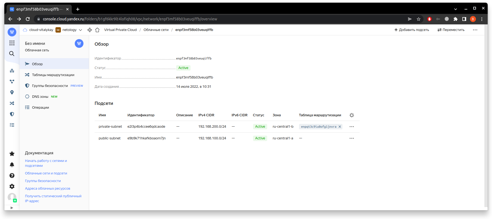

Так же *terraform* создает файл ansible/inventory/inventory.yml сос списком хостов и настройками SSH подключения для Ansible, после чего запускает плейбук с этим инвентори.

6. Применение изменений
Выполнение команд *terraform apply* и *terraform destroy* фиксируется в файле состояния в s3-backend
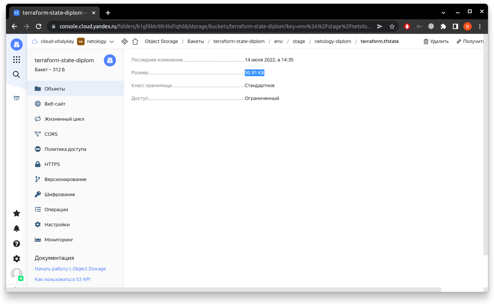

### 3.Установка Nginx и LetsEncrypt

Для Ansible прейбука разработаны 2 роли:
* [nginx](ansible/roles/nginx/README.md) - роль только для установки nginx, поддерживаются ОС Ubuntu и CentOS
* [nginx-proxy-install](ansible/roles/nginx-proxy-install/README.md) - роль для установки LetsEncrypt certbot, получения тестовых сертификатов и настройки HTTPS реверс-прокси. Переменные: 
  + domain_name - зарегистрированное доменное имя для реверс-прокси и сертификатов
  + email - адрес электронной почты для создания сертификатов

В результате выполнения ролей на виртуальной машине с имененм nginx-node с публичным адресом установлен Nginx и настроен как реверс-прокси для URL из п.1, установлен LetsEncript certbot и получены тестовые сертификаты
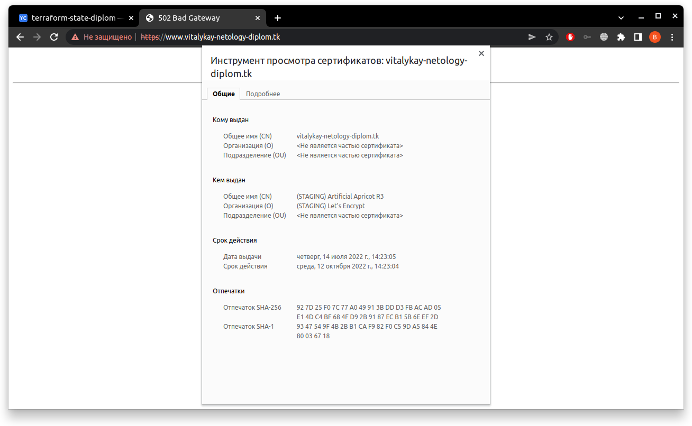

### 4.Установка кластера MySQL

Для Ansible прейбука разработаны 3 роли:
* [mysql-install](ansible/roles/mysql-install/README.md) - роль для установки сервера MySQL. Данная роль устанавливает сервер и cli-клиент mysql, меняет временный пароль пользователя root и создает для него файл .my.cnf для последующей авторизации cli-клиента и модулей Ansible. Переменные:
  + mysql_root_pass - задает пароль пользователя root
* [mysql-config-cluster](ansible/roles/mysql-config-cluster/README.md) - роль для настройки кластера из 2-х серверов MySQL с именами хостов mysql-server и mysql-slave с репликацией Master-Slave
* [create-wordpress-db](ansible/roles/create-wordpress-db/README.md) - роль для автоматического создания базы данных для Wordpress и пользователя с полными правами для этой БД. Переменные:
  + wordpress_user - имя пользователя для БД Wordpress
  + wordpress_password - пароль пользователя БД Wordpress
  + wordpress_db - имя базы данных Wordpress

В результате выполнения ролей создается кластер из двух серверов MySQL, автоматически создается БД Wordpress и пользователь с полными правами на нее. 
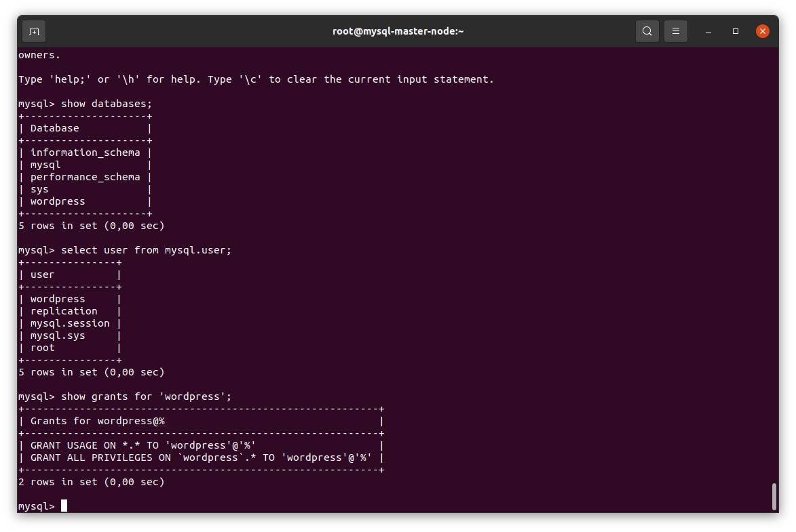

### 5.Установка Wordpress

В Ansible плее для данного пункта выполняются 4 роли:
* [nginx](ansible/roles/nginx/README.md) - переиспользованная роль из п.3
* [php-install](ansible/roles/php-install/README.md) - роль для установки PHP, необходимого для работы Wordpress. Переменные:
  + php_version - версия PHP (по умолчанию 74)
* [wordpress](ansible/roles/wordpress/README.md) - роль для установки Wordpress и настройки подключения к БД из п.4. Переменные:
  + wordpress_domain - имя домена, на которое настроен nginx, должно совпадать с именем домена, настроенным на реверс-прокси в п.3
  + nginx_user - имя пользователя nginx, необходимо для корректного доступа сервера nginx к файлам Wordpress
  + wordpress_user - имя пользователя БД Wordpress из п.4
  + wordpress_password - пароль пользователя БД Wordpress из п.4
  + wordpress_db - имя БД Wordpress из п.4
* [nginx-wordpress-config](ansible/roles/nginx-wordpress-config/README.md) - роль для настройки сервера nginx на работу с Wordpress. Переменные:
  + wordpress_domain - имя домена, на котором будет работать Wordpress, должно совпадать с именем домена, настроенным на реверс-прокси в п.3

В результате выполнения ролей на виртуальную машину с именем wordpress-node устанавливается Nginx и Wordpress. Wordpress подключен к БД в кластере MySQL.

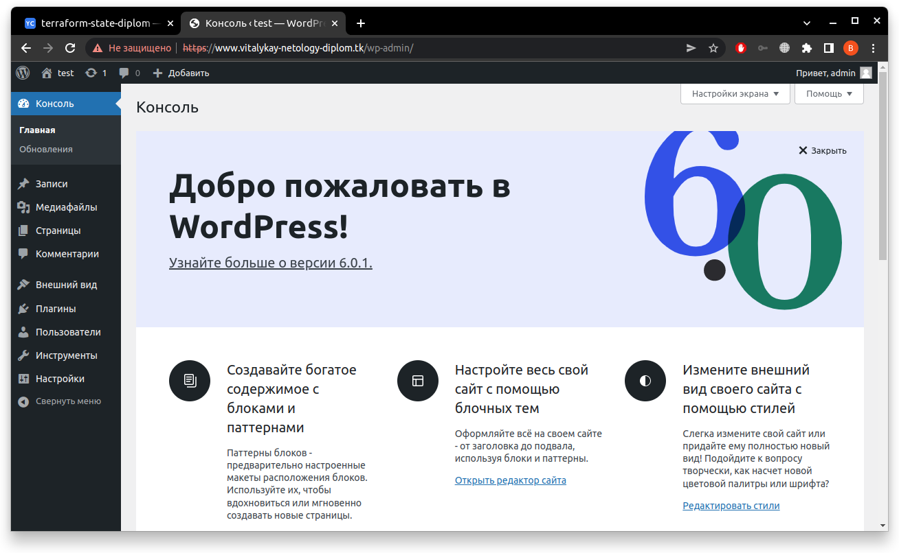

### 6.Установка Gitlab CE и Gitlab Runner

Для установки Gitlab-CE разработаны 2 роли:
* [gitlab-ce-install](ansible/roles/gitlab-ce-install/README.md) - роль для установки сервера Gitlab CE, первичной настройки имени домена и пароля пользователя root, получения токена для регистрации runner. Переменные:
  + gitlab_domain - имя домена gitlab, должно совпадать с именем заданным на реверс-прокси в п.3
  + gitlab_root_password - пароль пользователя root
* [gitlab-runner-install](ansible/roles/gitlab-runner-install/README.md) - роль для установки gitlab runner и регистрации его на сервере gitlab, с помощью полученного в предыдущей роли токена

?????????? CI/CD ???????????????????

### 7.Установка Prometheus, Alertmanager, Node_exporter, Grafana

Для установки стека мониторинга разработаны 5 ролей:
* [node-exporter-install](ansible/roles/node-exporter-install/README.md) - роль для установки и запуска сервиса node_exporter
* [mysqld-exporter-install](ansible/roles/mysqld-exporter-install/README.md) - роль для установки сервиса mysqld_exporter на серверах MySQL с созданием пользователя с минимально необходимыми правами.
* [prometheus-install](ansible/roles/prometheus-install/README.md) - роль для установки и настройки Prometheus. Роль создает файл настройки для prometheus c jobs, получающими метрики со всех node_exporter и mysqld_exporter на основе инвентори, добавляет подключение и правила алертов для Alertmanager.
* []